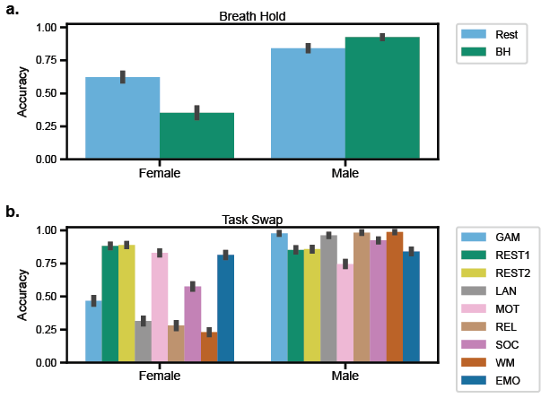

# Overview

Code for pre-print "Can we trust machine learning in fMRI? Simple adversarial attacks break connectome-based predictive models" https://osf.io/ptuwe/

Neuroimaging-based predictive models continue to improve in performance, yet a widely overlooked aspect of these models is “trustworthiness,” or robustness to data manipulations. High trustworthiness is imperative for researchers to have confidence in their findings and interpretations. In this work, we used functional connectivity data to explore how minor data manipulations influenced machine learning predictions. These manipulations included a novel method to falsely enhance prediction performance, adversarial noise attacks designed to degrade performance, and within-scanner changes (i.e., breath-holding) that influence model accuracy. Overall, we found that predictions can be drastically changed with only minor manipulations, which demonstrates the low trustworthiness of current implementations of connectome-based pipelines. These findings highlight the need for counter-measures that improve the trustworthiness of connectome-based analysis pipelines to preserve the integrity of academic research. 


# Setup
- Install or open MATLAB (future updates may include Python code)
- Download the code in this repository
- Add the utils folder to your MATLAB path
  ```
  addpath(genpath('your path to utils folder'))
  ```
- Prepare functional connectome data with shape (# nodes x # nodes x # participants)
- Change the load / save paths in the .m files to work with your machine
- Run any of the following commands
- (optional) Download the Brain Connectivity Toolbox (https://sites.google.com/site/bctnet/) and add this folder to your MATLAB path

# Minimal code
Use this code if you want to test how effective enhancement is for your specific dataset. Please use responsibly

## connectome_enhancement.m

After preparaing connectome data, you can evaluate enhancement attacks. An example call for an attack altering 20% of features and with a mean absolute value of alterations of 0.01. More options are described in the .m file.
```
connectome_enhancement(X, y, 'per_enhance', 0.2, 'scale', 0.01)
```

## time_series_enhancement.m

After preparaing node time-series data (# participants x # nodes x # time points), you can evaluate enhancement attacks. An example call for an attack is below. The scale variable scales the time-series enhancement pattern. More options are described in the .m file.

```
time_series_enhancement(X_ts, y, 'per_enhance', 0.2, 'scale', 0.04)
```


# Paper code / all experiments

## Enhancement

To run the enhancement attack for Human Connectome Project data (you will need your own data to load) for random seeds 1-10, you can run the following file:

``` 
enhancement_attack('hcp', 1, 10)
```


Further functions to analyze differences between original and enhanced data (i.e., functional connectome fingerprinting, graph properties) can be run with 

```
run_analysis('hcp', 1, 10)
```

## Adversarial noise

```
run_adv_noise('hcp', 1, 10)
```


## Real-world manipulations

```
run_trust_taskswap(1, 10)
```




# References
Brain Connectivity Toolbox: https://sites.google.com/site/bctnet/ (download this code for analysis)

Yale MRRC Github: https://github.com/YaleMRRC/CPM (acted as base for some code in this project)

Biggio et al. 2013: https://link.springer.com/content/pdf/10.1007/978-3-642-40994-3_25.pdf (adversarial noise method)

# Other

Feel free to e-mail matthew.rosenblatt@yale.edu with any questions or concerns
